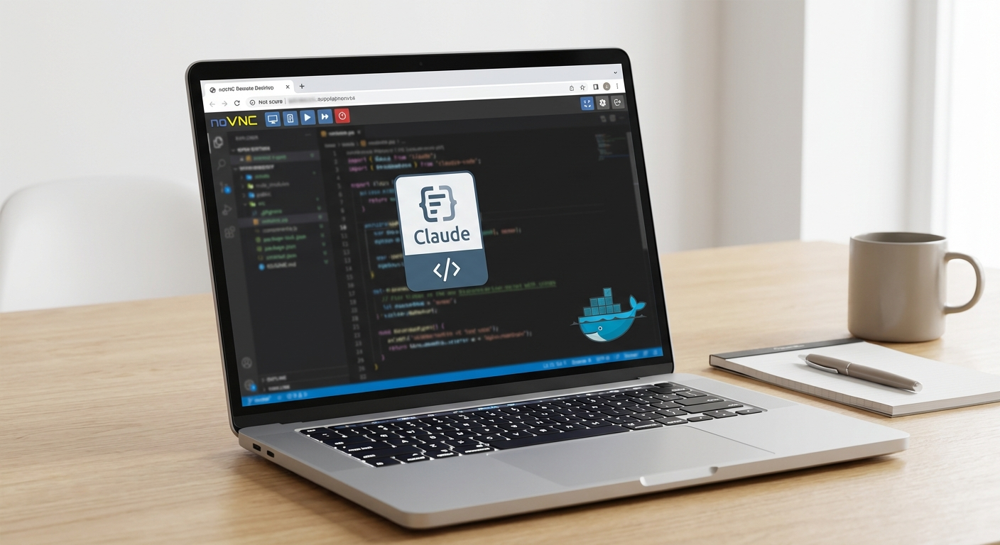
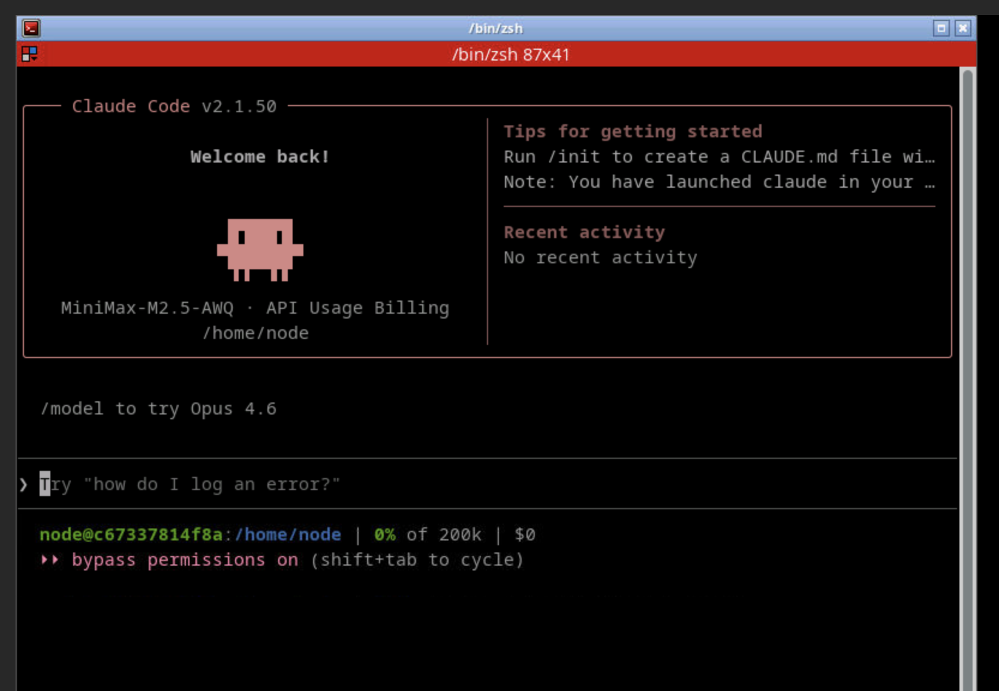
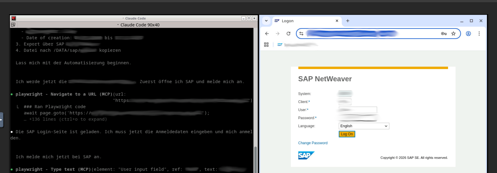
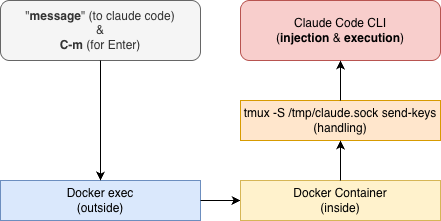
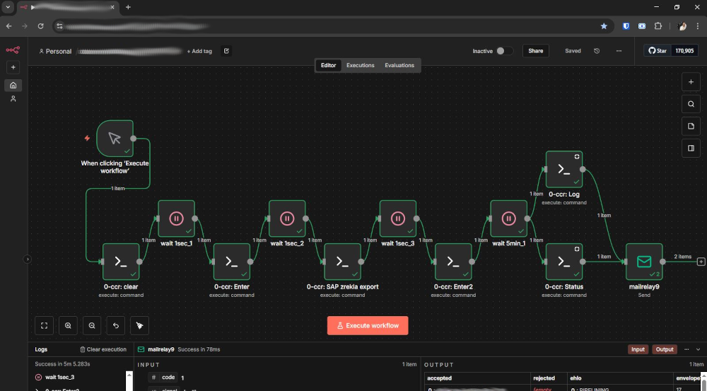

# A2S-AI (Build and Run)

```
git clone https://github.com/a2s-ai/A2S_claude-code.git

cd A2S_claude-code/A2S_BUILD_AND_RUN/

./docker_build_and_run.sh
```

# noVNC Browser Access (without nginx reverse proxy)

* http://localhost:10001/vnc.html
* * Launch the terminal emulator in the current noVNC session in order to connect to the claude code tmux session

# claude-code-novnc



# A2S-AI Features

* Docker‑based Claude Code Environment
* Easy noVNC Browser Access
* Playwright MCP Chromium / Google-Chrome Support
* Filesystem MCP Support
* Memory MCP Support for Claude Code
* Example of using an alternative MiniMax‑M2 vLLM model (privacy first)
* Claude Code CLI "Message" Injection from Docker Host
* * (for n8n / SSH - Remote Automation)

# A2S GPU Server - vLLM with MiniMax-M2.1-AWQ

* Proxmox PVE 8 / 9 - GPU Passthrough & vGPU Support
* * https://pve.proxmox.com/wiki/PCI_Passthrough
* * https://pve.proxmox.com/wiki/NVIDIA_vGPU_on_Proxmox_VE
* * https://research.colfax-intl.com/gpu-passthrough-on-proxmox-ve-8/

* Ubuntu 24 LTS VM with 4 x NVIDIA RTX 6000A (GPU Passthrough)

## vLLM (Docker) Settings with 194K (full) Context

```
root@ai-ubuntu24gpu-large:/opt# cat run-vllm-max_a2s-ai_MiniMax-M2.1-AWQ.sh
#!/bin/sh
# Developed: Daniel Plominski for A2S.AI (03.01.2025)

export HUGGING_FACE_HUB_TOKEN=hf_XXX-XXX-XXX-XXX
export CUDA_VISIBLE_DEVICES="0,1,2,3"

docker network create vllm-minimax

docker run \
       --name vllm-minimax \
       --network vllm-minimax \
       --gpus all \
       --runtime=nvidia \
       --ipc=host \
       --restart unless-stopped -d --init \
       -p 8000:8000 \
       -v /data/opt/vllm:/root/.cache/huggingface \
       vllm/vllm-openai:nightly \
         --model a2s-ai/MiniMax-M2.1-AWQ \
         --served-model-name MiniMax-M2.1-AWQ \
         --tensor-parallel-size 4 \
         --enable-auto-tool-choice \
         --tool-call-parser minimax_m2 \
         --reasoning-parser minimax_m2_append_think \
         --max-model-len 194560 \
         --enable-expert-parallel \
         --trust-remote-code

# EOF
root@ai-ubuntu24gpu-large:/opt#
```

# Example: Claude Code



# Example: Claude Code - MCP (Browser Use) - SAP Automation !



# Support for Claude Code CLI "Message" Injection from Docker Host

## RUN

```
docker exec claude-code-novnc-1 /tmux_ctl_send.sh /clear
docker exec claude-code-novnc-1 /tmux_ctl_send.sh C-m

docker exec claude-code-novnc-1 /tmux_ctl_send.sh "Go to the /home/node/workspace/projects/sap directory. Use CLAUDE.md as the workflow template and export the latest SAP zrekal."
docker exec claude-code-novnc-1 /tmux_ctl_send.sh C-m
```

## Logging / Status

```
docker exec claude-code-novnc-1 /tmux_print_output.sh
```

## Schema



# Example: n8n Automation

## SAP process automation through intelligent, autonomous browser control.



# Example: Nginx as Reverse Proxy

```
root@docker-middleware-prod1:/etc/nginx# egrep -B 2 -A 8 "Connection header for WebSocket reverse proxy" nginx.conf

        ##
        # Connection header for WebSocket reverse proxy
        ##
        map $http_upgrade $connection_upgrade {
            default upgrade;
            ''      close;
        }

    ##
    # Virtual Host Configs
root@docker-middleware-prod1:/etc/nginx#
```

```
root@docker-middleware-prod1:/etc/nginx/sites-enabled# cat claude-code-novnc-1

server {
    server_name claude-code-novnc-1.yourdomain.local;
    listen XXX-XXX-XXX-XXX:10001 ssl;

    ssl_certificate     /etc/ssl/certs/ssl-cert-snakeoil.pem;
    ssl_certificate_key /etc/ssl/private/ssl-cert-snakeoil.key;

    ssl_protocols TLSv1.2 TLSv1.3;
    ssl_prefer_server_ciphers off;

    ssl_session_cache shared:SSL:10m;
    ssl_session_timeout 10m;

    gzip            on;
    gzip_vary       on;
    gzip_proxied    any;
    gzip_comp_level 6;
    gzip_types      text/plain text/css text/xml application/json application/javascript application/rss+xml application/atom+xml image/svg+xml;

    proxy_http_version                 1.1;
    proxy_cache_bypass                 $http_upgrade;
    proxy_set_header Upgrade           $http_upgrade;
    proxy_set_header Connection        $connection_upgrade;
    proxy_set_header X-Real-IP         $remote_addr;
    proxy_set_header X-Forwarded-For   $proxy_add_x_forwarded_for;
    proxy_set_header X-Forwarded-Proto $scheme;
    proxy_set_header X-Forwarded-Host  $host;
    proxy_set_header X-Forwarded-Port  $server_port;
    proxy_set_header Host              $host;

    client_max_body_size               999m;

    proxy_connect_timeout              300s;
    proxy_send_timeout                 300s;
    proxy_read_timeout                 300s;

    proxy_set_header Authorization "";

    #// for VNC
    location = / {
        auth_ldap "Active Directory Login";
        auth_ldap_servers ad_ldap;

    proxy_pass http://127.0.0.1:10001/vnc.html;
    }

    #// Default
    location / {
        auth_ldap "Active Directory Login";
        auth_ldap_servers ad_ldap;

    proxy_pass http://127.0.0.1:10001;
    }

    location ~ /\.(?!well-known) {
        deny all;
    }

    location = /favicon.ico {
        log_not_found off;
        access_log    off;
    }

    location = /robots.txt {
        log_not_found off;
        access_log    off;
    }

}

root@docker-middleware-prod1:/etc/nginx/sites-enabled#
```

# Ensure the noVNC Docker and vLLM integrations are secured via HAProxy / Traefik with proper SSL settings !

* https://github.com/haproxy/haproxy

* https://github.com/traefik/traefik

## Acknowledgements

This project would not have been possible without the outstanding work and contributions of the following teams and communities, who provide the foundations, tools, and technologies it builds upon:

* Anthropic Claude Code Team
* * https://github.com/anthropics/claude-code/graphs/contributors

* vLLM Team
* * https://github.com/vllm-project/vllm/graphs/contributors

* MiniMax Team - for the Large Language Models
* * https://github.com/MiniMax-AI

* QuantTrio Team – for their work on LLM model quantization
* * https://huggingface.co/QuantTrio

* n8n Team
* * https://github.com/n8n-io/n8n/graphs/contributors

* Google Chrome Team
* * https://github.com/orgs/GoogleChrome/people

* Docker Team
* * https://github.com/orgs/docker/people

* NVIDIA Team
* * https://github.com/nvidia

* Proxmox Team
* * https://github.com/proxmox

* The global Linux Community

Thank you to all contributors and maintainers for your dedication to open-source software and for enabling projects like this one.

### EOF
